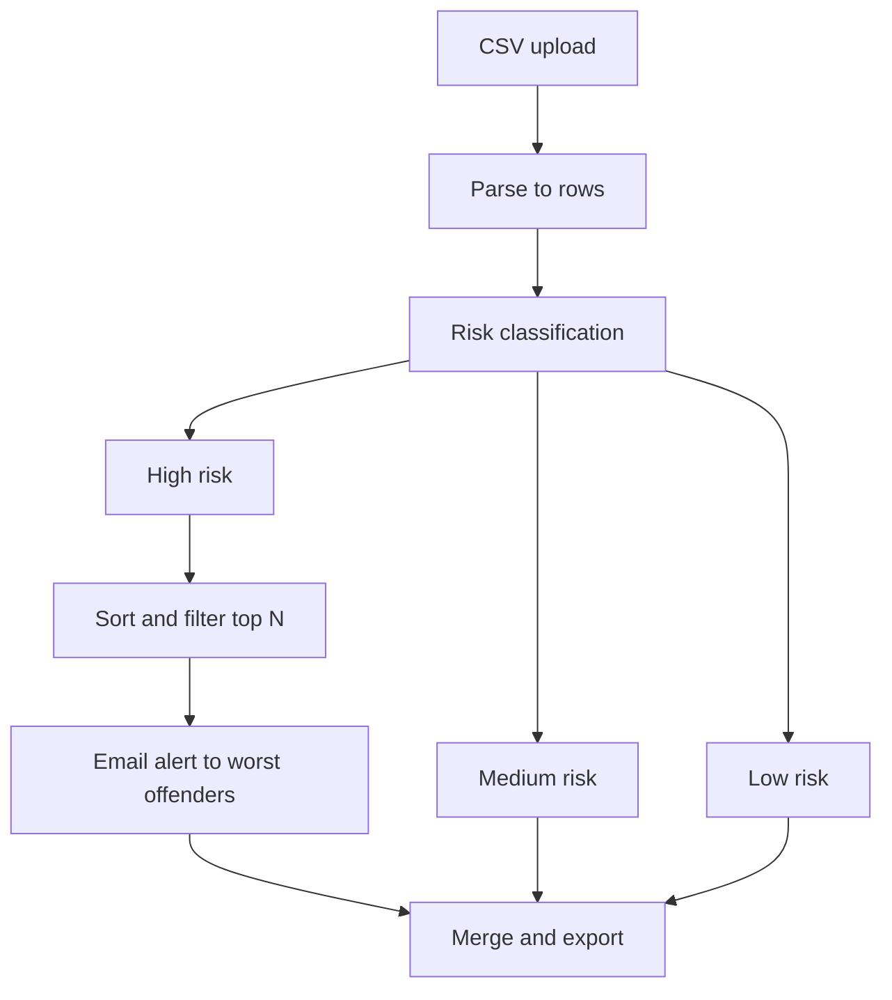

# AI-Driven ESG Risk Scoring for Manufacturing Suppliers

An n8n workflow automation that classifies manufacturing suppliers into ESG (Environmental, Social and Governance) risk tiers based on emissions data, and automatically alerts the highest-risk suppliers — no manual review required.

## Overview

This project automates ESG risk assessment for manufacturing suppliers to support sustainability initiatives and Net Zero goals. Instead of manually reviewing supplier emissions data, the workflow ingests a CSV file, applies rule-based classification logic, and outputs a fully labelled dataset ready to feed into ESG reporting.

Supplier data is sourced from [Climate TRACE](https://climatetrace.org/), a public global emissions dataset, using two key fields:

- **`emissions_quantity`** — greenhouse gas emissions, measured in metric tonnes
- **`difficulty_score`** — how complex and costly it would be for that supplier to reduce emissions

Based on these two variables, suppliers are automatically sorted into **High**, **Medium**, or **Low** risk categories.

## How it works

1. A CSV file is uploaded via an n8n form trigger.
2. The file is parsed into structured rows.
3. Each supplier is evaluated against rule-based thresholds:
   - **High Risk:** emissions > 40,000 tonnes **and** difficulty score > 3
   - **Medium Risk:** emissions > 20,000 tonnes **and** difficulty score > 2
   - **Low Risk:** everything else
4. High Risk suppliers are sorted by emissions and the top offenders are automatically emailed an alert.
5. All three risk tiers are merged back together into a single classified output file.

This rule-based approach was chosen deliberately over a machine learning model — it keeps the logic fully transparent and explainable, which matters for ESG reporting where stakeholders need to understand *why* a supplier was flagged.

## Architecture



## Tech stack

- **n8n** — workflow orchestration (Form Trigger, Extract from File, IF, Set, Sort, Limit, Merge, Gmail nodes)
- **Climate TRACE** — public emissions dataset
- **Gmail node** — automated alert delivery to high-risk suppliers

## Project structure

```
n8n-esg-risk-scoring/
├── workflow/
│   └── esg-risk-scoring.json   # Exported n8n workflow (importable)
├── assets/
│   └── n8n-canvas-screenshot.png
└── README.md
```


> **Note:** No supplier data is included in this repository. The original dataset is not published here for data hygiene reasons; the workflow can be tested with any CSV matching the schema above.

## Author

Dharshini Balakrishnan
